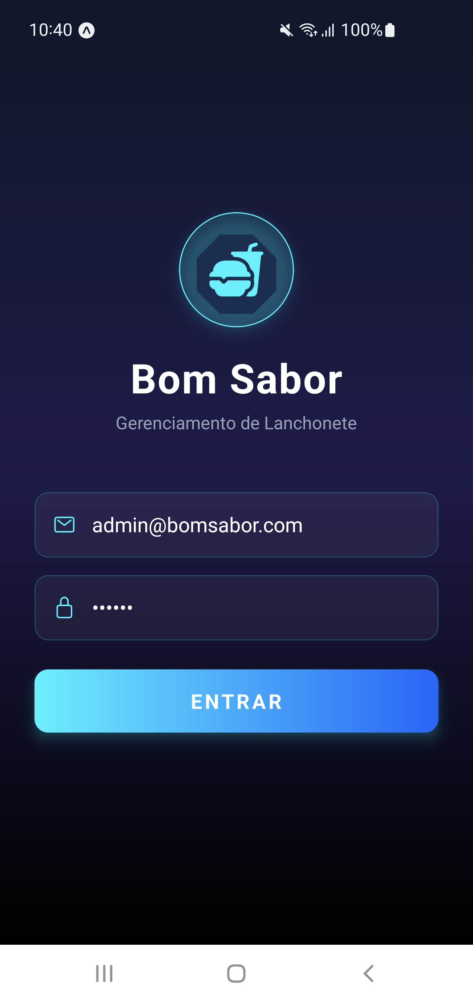
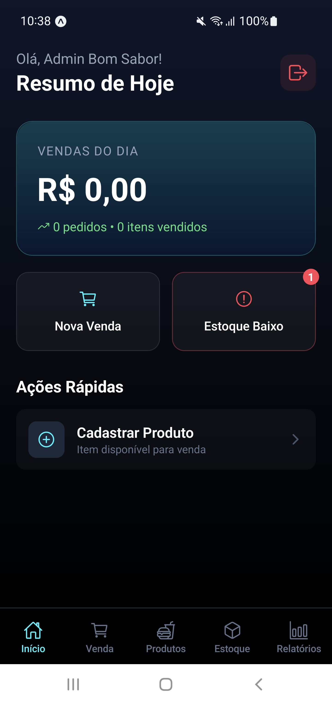
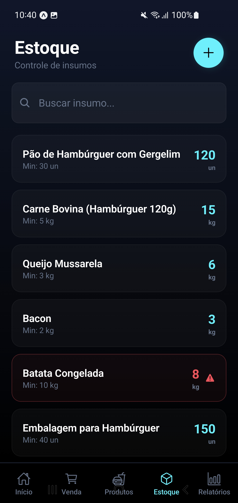
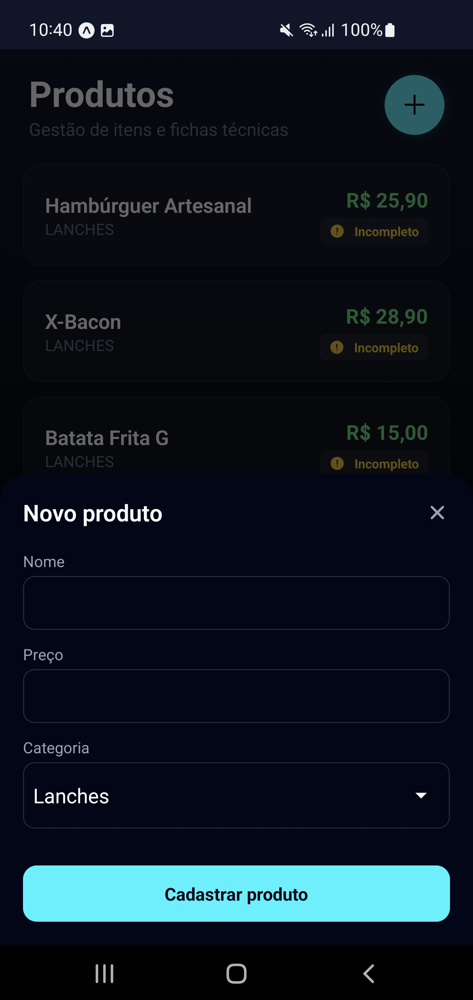

<div align="center">
    <h1>🍔 Lanchonete Bom Sabor – App Mobile de Controle de Vendas e Estoque</h1>
  <a href="https://react.dev/" target="_blank">
    
  </a>
  <a href="https://www.typescriptlang.org/" target="_blank">
    
  </a>
  <a href="https://firebase.google.com/" target="_blank">
    
  </a>
  <a href="#" target="_blank">
    
  </a>
</div>

---

## 🚀 Sobre o Projeto

Este projeto é parte da **atividade avaliativa extracurricular** da disciplina **Programação para Dispositivos Móveis (7º semestre – Faculdade Estácio)**, com foco em desenvolver um **aplicativo Android para controle de vendas e estoque** em uma lanchonete local.

O aplicativo foi projetado para **simplificar o fluxo operacional**, automatizando registro de vendas, controle de estoque, relatórios básicos e autenticação de usuários, contribuindo para a **eficiência econômica e redução de erros** na gestão do estabelecimento.

---

## 🧾 Diagnóstico e Teorização

### 1. Identificação das Partes Envolvidas

- **Nome do Projeto:** Sistema móvel de controle de vendas e estoque para lanchonete local
- **Parceiro Comunitário (Fictício):** Lanchonete Bom Sabor
  - Endereço: Rua Exemplo, 123, Bairro Centro, Cidade/UF
  - CNPJ: 12.345.678/0001-90
  - Website: [lanchonetebomsabor.exemplo](https://lanchonetebomsabor.exemplo)
- **Principais Colaboradores:**
  - João Silva — proprietário / gestor operacional — +55 (XX) 9XXXX-XXXX
  - Maria Souza — caixa / responsável por estoque
  - Carlos Pereira — cozinheiro (usuário final)
- **Perfil socioeconômico:**
  - Faixa etária: 25–55 anos
  - Escolaridade: Ensino médio completo (maioria)
  - Gênero: misto
  - Observação: interface simples e clara necessária, resistência inicial a telas complexas

### 2. Situação-Problema

A lanchonete registra vendas e estoques de forma manual (caderneta ou Excel), gerando:

- Erros de registro e troca de valores
- Desperdício por validade e compras excessivas
- Dificuldade de previsão de compras
- Atrasos no fechamento de caixa e inconsistência entre caixa e estoque

### 3. Demanda Sociocomunitária e Motivação Acadêmica

**Impacto comunitário:** melhora da gestão financeira, redução de desperdícios e ganhos de eficiência operacional.  
**Motivação acadêmica:** aplicar conceitos de **programação móvel**, design de UI/UX, persistência de dados com **Firebase**, testes unitários, integração com backend, e avaliação prática de software.

### 4. Objetivos

**Objetivo geral:** Desenvolver e implantar um aplicativo Android para controle de vendas e estoque, com autenticação e relatórios básicos.

**Objetivos específicos:**

- Cadastro de produtos com código, preço e estoque (até 4 semanas)
- Registro de vendas com decremento automático do estoque e recibo digital (até 6 semanas)
- Treinamento de 3 funcionários em 1 sessão presencial (2h) até 10 semanas
- Redução de divergências entre vendas e estoque ≥50% em 4 semanas pós-implantação

---

## 🛠️ Planejamento e Desenvolvimento

### 1. Cronograma

| Semana | Atividade                                             |
| ------ | ----------------------------------------------------- |
| 1      | Levantamento de requisitos (entrevistas + observação) |
| 2      | Modelagem de dados e protótipos (Figma)               |
| 3      | Configuração do projeto (Expo) e Firebase             |
| 4      | Implementação de telas de produtos e estoque          |
| 5      | Implementação da tela de vendas e lógica de estoque   |
| 6      | Implementação de relatórios e histórico de vendas     |
| 7      | Testes unitários e TDD em funções críticas            |
| 8      | Ajustes de usabilidade e correções                    |
| 9      | Testes beta com usuários na lanchonete                |
| 10     | Treinamento prático dos funcionários                  |
| 11     | Coleta de feedback e ajustes finais                   |
| 12     | Entrega final, relatório e evidências                 |

### 2. Metodologia

- **Coleta de requisitos:** entrevistas semiestruturadas + observação direta
- **Protótipos:** telas de baixa/média fidelidade no Figma
- **Desenvolvimento:** React Native + Expo + Firebase (Authentication + Firestore)
- **Qualidade:** testes unitários (Jest) e testes manuais
- **Treinamento e entrega:** sessão prática com manual rápido em PDF
- **Avaliação:** comparação antes/depois dos indicadores + questionário de satisfação

### 3. Avaliação dos Resultados

- Planilhas de comparação (vendas/estoque 4 semanas antes x 4 semanas depois)
- Questionário de satisfação (Likert 1–5)
- Observação direta (tempo médio de fechamento de caixa)

**Indicadores-chave:**

- % de redução de divergências estoque x vendas
- Tempo médio de fechamento de caixa
- Satisfação média dos usuários (meta ≥4)
- Número de erros de operação por semana

---

## 📂 Estrutura do Projeto

```text
lanchonete-bom-sabor-app/
├─ app/ -> UI e rotas
├─ src/ -> Lógica da aplicação (contexts, services, hooks, types, utils)
├─ assets/images/ -> Recursos visuais
├─ tsconfig.json
├─ package.json
└─ README.md
```

---

## ⚡ Tecnologias e Conceitos

| Categoria                   | Ferramentas / Conceitos                  |
| --------------------------- | ---------------------------------------- |
| **Framework**               | React Native + Expo                      |
| **Linguagem**               | TypeScript                               |
| **Backend / DB**            | Firebase Authentication + Firestore      |
| **UI/UX**                   | React Navigation, componentes funcionais |
| **Gerenciamento de estado** | Context API                              |
| **Testes**                  | Jest (unitários)                         |
| **Utilitários**             | Formatação de moeda e datas              |

---

## ⚙️ Como Rodar

Instalar dependências:

```bash
npm install
```

Rodar o servidor de desenvolvimento:

```bash
npm run start
```

Executar testes:

```bash
npm run test
```

---

## 🪪 Evidências do Projeto

- Capturas de tela das telas do aplicativo
- Vídeos de uso e demonstração na lanchonete
- Lista de presença da sessão de treinamento
- Links para o repositório GitHub com código fonte
- Relatórios de feedback e planilhas de indicadores

**Termo de Responsabilidade:**

> Atesto que esta Atividade de Extensão foi realizada com participação efetiva da comunidade, conforme relatório apresentado no Laboratório de Extensão da Sala de Aula Virtual, sendo de autoria própria e entregue dentro do prazo acadêmico.

---

## 🌟 Melhorias Futuras

- Integração de QR Code para vendas rápidas
- Dashboard de indicadores em tempo real
- Relatórios gráficos de vendas e estoque
- Notificações de produtos próximos da validade

---

## 🖼️ Galeria do Projeto

A seguir, algumas imagens das telas e do desenvolvimento do aplicativo:

<div style="display: flex; flex-wrap: wrap; gap: 10px; justify-content: center;">

  <div style="flex: 1 1 45%; text-align: center;">
    
    <p>Tela de Login</p>
  </div>

  <div style="flex: 1 1 45%; text-align: center;">
    
    <p>Tela Principal / Tabs</p>
  </div>

  <div style="flex: 1 1 45%; text-align: center;">
    
    <p>Listagem e cadastro de Insumos</p>
  </div>

  <div style="flex: 1 1 45%; text-align: center;">
    
    <p>Listamento e cadastro de Produtos Venda</p>
  </div>

</div>

---

## 🪪 License

Este projeto é destinado a **fins educacionais e acadêmicos**, podendo ser explorado e adaptado, com devido crédito ao autor.

---

<br>
<br>

<p align="center">
  <i>Soli Deo Gloria</i>
</p>
